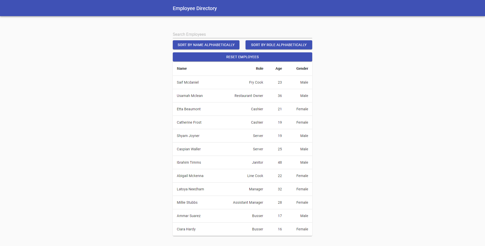

# Employee Directory
  
## Languages
&ensp;&ensp;&ensp;&ensp;&ensp;
## Description
Employee Directory is a react application that easily allows a user to search and filter through a list of employees.

## Table of Contents
* [Installation](#Installation)
* [Usage](#Usage)
* [Contributing](#Contributing)
* [License](#License)
* [Languages](#Languages)
* [Contact](#Contact)

## Installation
Clone the repository, and run npm install to install dependencies. Once dependencies are installed run npm start to launch the react application.

## Usage
To use the application the user can search in the search bar to filter the employees by name or role, Or click on the buttons provided to sort the employees alphabetically by name or role.

## License
MIT

## Contributing
Feel free to create a pull request.

## Contact
Forrest Miller

[Click here to visit my website](http://www.forrestmillerdesign.com/)